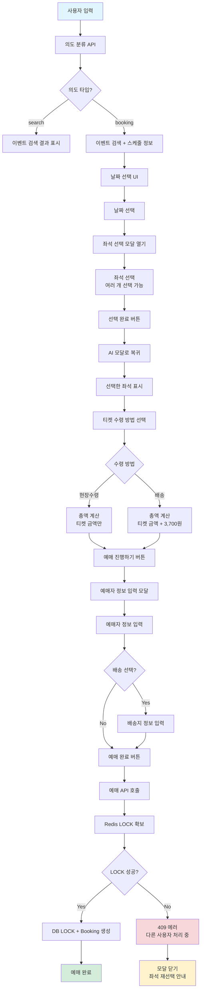

# AI 콘서트 예매 에이전트 플로우

## 전체 플로우 다이어그램



## 단계별 상세 플로우

### 1단계: 검색 및 의도 분류

```
사용자: "XXX 콘서트 예매하고 싶어"
    ↓
[프론트엔드] AISearchModal.handleSubmit()
    ↓
[백엔드] POST /api/v1/events/ai/intent
    → 의도 분류: "booking"
    ↓
[백엔드] POST /api/v1/events/search/ai
    → 이벤트 검색
    → 스케줄 정보 포함
    ↓
[프론트엔드] 검색 결과 표시
    → 이벤트 정보
    → 날짜 선택 UI 표시
```

### 2단계: 날짜 선택

```
사용자가 날짜 선택
    ↓
selectedScheduleId 설정
    ↓
"좌석 선택하기" 버튼 활성화
    ↓
클릭 시 handleScheduleSelect()
    ↓
SeatSelectionModal 열기
```

### 3단계: 좌석 선택

```
[SeatSelectionModal]
    ↓
GET /api/v1/events/{event_id}/tickets?schedule_id={schedule_id}
    → 해당 날짜의 좌석 목록 조회
    ↓
좌석 그리드 표시
    - 행별로 그룹화
    - 등급별 색상 구분
    - 선택/해제 가능
    ↓
사용자가 좌석 선택
    - 다중 선택 가능
    - 실시간으로 선택 좌석 요약 표시
    ↓
"선택 완료" 버튼 클릭
    ↓
onSeatsSelected(selectedSeats) 호출
    ↓
모달 닫기
```

### 4단계: 티켓 수령 방법 선택

```
[AI 모달로 복귀]
    ↓
선택한 좌석 목록 표시
    - 좌석 번호, 등급, 가격
    - 티켓 금액 합계
    ↓
티켓 수령 방법 선택
    - 이벤트의 ticket_receipt_method에 따라 옵션 필터링
    - 현장수령 / 배송 선택
    ↓
총 결제금액 계산
    - 티켓 금액
    - 배송료 (배송 선택 시 +3,700원)
    ↓
"예매 진행하기" 버튼 활성화
    - 티켓 수령 방법 선택 필수
```

### 5단계: 예매자 정보 입력

```
"예매 진행하기" 클릭
    ↓
BookingInfoModal 열기
    ↓
GET /api/v1/auth/me
    → 사용자 정보 자동 로드
    ↓
예매자 정보 입력
    - 이름 (필수)
    - 연락처 (필수)
    - 이메일 (선택)
    ↓
[배송 선택 시]
    ↓
배송지 정보 입력
    - 우편번호 (다음 주소 API)
    - 주소
    - 상세주소
```

### 6단계: 예매 완료

```
"예매 완료" 버튼 클릭
    ↓
POST /api/v1/bookings
    ↓
[백엔드 처리]
    ├─ 1. 모든 좌석에 대해 Redis LOCK 시도
    │   ├─ 같은 사용자 LOCK 확인
    │   └─ 없으면 새로 LOCK 획득
    ├─ 2. DB 트랜잭션 시작
    ├─ 3. SELECT FOR UPDATE로 좌석 LOCK
    ├─ 4. 예약 가능 여부 확인
    ├─ 5. Booking 생성
    └─ 6. 트랜잭션 커밋
    ↓
[성공]
    → "예매가 완료되었습니다!" 알림
    → 상태 초기화
    → 완료 메시지 표시
    
[실패 - 409 Conflict]
    → "좌석이 다른 사용자에 의해 처리 중입니다" 알림
    → 모달 닫기
    → 좌석 재선택 안내
```

## 데이터 흐름

```
AISearchModal
    ├─ searchResult: { eventId, eventTitle, schedules, intent }
    ├─ selectedScheduleId: number | null
    ├─ selectedSchedule: EventScheduleForSearch | null
    ├─ selectedSeats: Ticket[]
    └─ receiptMethod: "delivery" | "on_site" | null
        ↓
SeatSelectionModal
    ├─ selectedSeats: Ticket[]
    └─ onSeatsSelected(seats)
        ↓
AISearchModal
    └─ selectedSeats 업데이트
        ↓
BookingInfoModal
    ├─ selectedSeats: Ticket[]
    ├─ receiptMethod: "delivery" | "on_site"
    └─ deliveryInfo: { name, phone, email, address, ... }
        ↓
POST /api/v1/bookings
    └─ CreateBookingRequest {
         event_id,
         schedule_id,
         seats: [{ row, number, grade, price }],
         total_price,
         receipt_method,
         delivery_info
       }
```

## 컴포넌트 구조

```
AISearchModal (메인 AI 검색 모달)
    ├─ 날짜 선택 UI
    ├─ 선택한 좌석 요약
    ├─ 티켓 수령 방법 선택
    └─ 총 결제금액 표시
        ↓
    SeatSelectionModal (좌석 선택 모달)
        └─ 좌석 그리드 + 선택 좌석 요약
        ↓
    BookingInfoModal (예매자 정보 입력 모달)
        ├─ 예매자 정보 입력
        └─ 배송지 정보 입력 (배송 선택 시)
```

## API 엔드포인트

1. **의도 분류**: `POST /api/v1/events/ai/intent`
2. **AI 검색**: `POST /api/v1/events/search/ai`
3. **이벤트 상세**: `GET /api/v1/events/{event_id}`
4. **좌석 목록**: `GET /api/v1/events/{event_id}/tickets?schedule_id={schedule_id}`
5. **예매 생성**: `POST /api/v1/bookings`
6. **사용자 정보**: `GET /api/v1/auth/me`

## 상태 관리

### AISearchModal
- `query`: 사용자 입력 쿼리
- `searchResult`: 검색 결과
- `selectedScheduleId`: 선택한 스케줄 ID
- `selectedSeats`: 선택한 좌석 목록
- `receiptMethod`: 티켓 수령 방법
- `isSeatModalOpen`: 좌석 선택 모달 열림 여부
- `isBookingModalOpen`: 예매자 정보 모달 열림 여부

### SeatSelectionModal
- `tickets`: 좌석 목록
- `selectedSeats`: 선택한 좌석 목록

### BookingInfoModal
- `deliveryInfo`: 예매자/배송지 정보
- `loading`: 처리 중 여부

## 에러 처리

1. **좌석 충돌 (409 Conflict)**
   - 다른 사용자가 같은 좌석 선택
   - 모달 닫기 + 재선택 안내

2. **필수 정보 누락**
   - 예매자 정보 또는 배송지 정보 누락 시 경고

3. **API 오류**
   - 적절한 에러 메시지 표시
   - 사용자에게 재시도 안내
